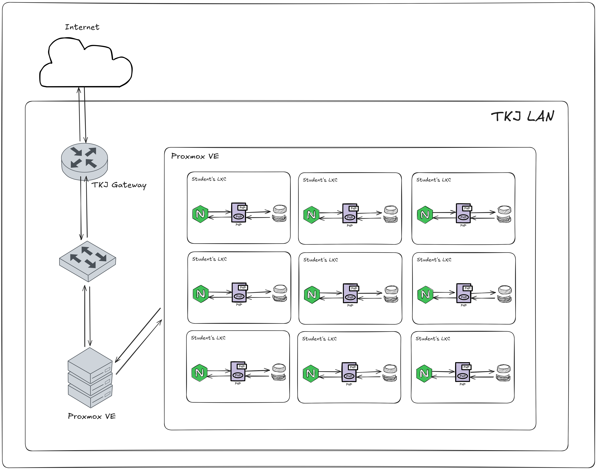

# NCE NSA Lab Playground 

This project utilizes Terraform to automate the provisioning of LXC containers on a Proxmox VE host and Ansible to provisioned Nginx study case material. It's designed to create a standardized environment for students, providing each group with their own container, user account, and a specific set of permissions only to access their own group container.

It was used for SMKN 5 Malang Network Computer Engineering Major, Network Server Administration course.

## 📝 Contents

The project uses [bpg/proxmox](https://registry.terraform.io/providers/bpg/proxmox/latest/docs) since it has more resources and fullfill the needs of the creator to automatically create and assign user to their own container.

The [`terraform`](./terraform/) setup automatically creates:
- An LXC container for each student group.
- A dedicated user account for each group on Proxmox.
- A restricted role to ensure students only have access to their own LXC.

The [`ansible`](./ansible/) setup automatically:
- Enable root SSH login on every LXC container
- Fix issue Debian LXC login delay (see [this thread](https://forum.proxmox.com/threads/unexplainable-delay-in-lxc-container.105285/post-453202))
- Install PHP, Nginx and MariaDB for study material
- Configured Laravel Webapp and static HTML website in `/var/www` directory

## 🖥️ Architecture Diagram


## 🗂️ File Contents

```txt
smkn5-tkj-lab/
└── terraform/  # Terraform configuration
└── ansible/    # Ansible playbooks
└── shell/      # Bash scripts
└── studies/    # Study material
└── nginx/      # Nginx vhost config file
```

## 🛠️ Stacks

