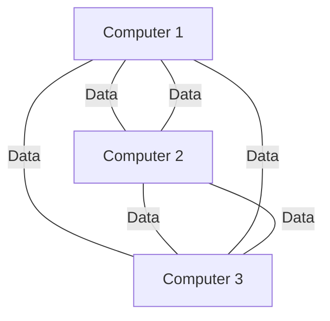
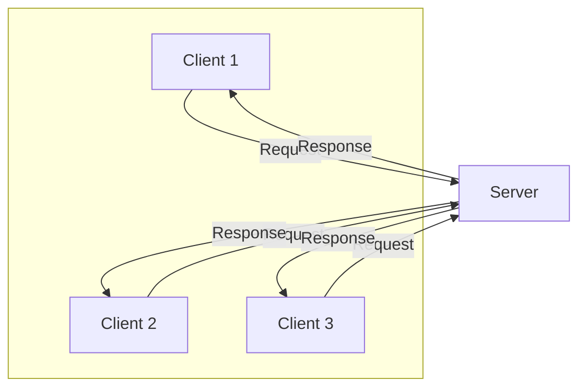
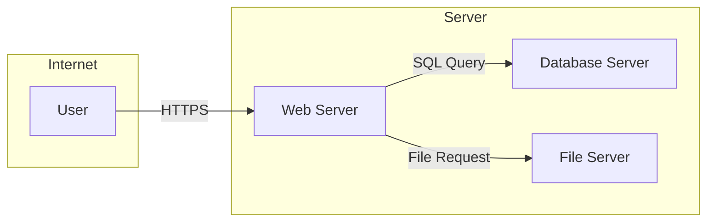
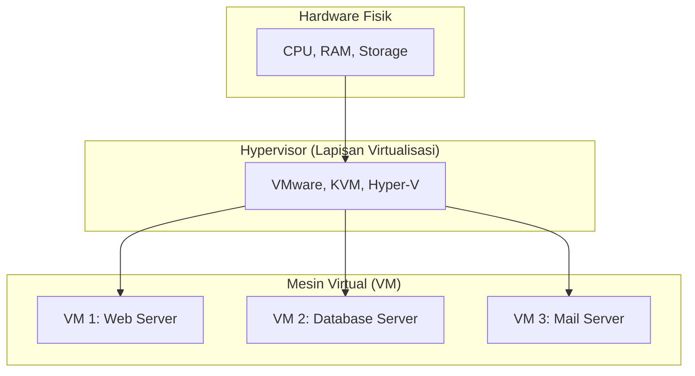

# Server & Virtualisasi

Membuka Jendela ke Dunia Komputasi Modern

---
transition: fade-out
---

# Arsitektur Jaringan

Ada dua model utama dalam arsitektur jaringan komputer:

  
 
    <v-click>
      <h3 class="text-2xl font-bold text-cyan-500">Peer-to-Peer (P2P)</h3>
      
Setiap komputer memiliki kedudukan yang sama, dapat bertindak sebagai klien maupun server.

      

      

    </v-click>
  

  

    <v-click>
      <h3 class="text-2xl font-bold text-lime-500">Client-Server</h3>
      
Terdapat server pusat yang menyediakan layanan dan klien yang meminta layanan tersebut.

      

      

    </v-click>
  

---
transition: slide-up
---

# Apa itu Server?

  

    

      Secara sederhana, <strong>server</strong> adalah komputer atau program yang menyediakan layanan untuk komputer lain (klien) dalam sebuah jaringan.
    

    <ul class="mt-4 list-disc pl-6 text-left">
      <li>Menyimpan, mengelola, dan mengirimkan data.</li>
      <li>Menjalankan aplikasi dan layanan.</li>
      <li>Mengatur akses dan keamanan jaringan.</li>
    </ul>
  

  

    
  

---
layout: two-cols
---

# Fungsi Utama Server

Server memiliki beragam fungsi sesuai dengan kebutuhannya.

<ul>
  <li><v-click>Web Server: Menyajikan halaman web ke browser. (Contoh: Apache, Nginx) </v-click></li>
  <li><v-click>File Server: Menyimpan dan berbagi file dalam jaringan. </v-click></li>
  <li><v-click>Database Server: Mengelola dan menyediakan akses ke database. (Contoh: MySQL, PostgreSQL) </v-click></li>
  <li><v-click>Mail Server: Mengelola pengiriman dan penerimaan email. </v-click></li>
  <li><v-click>DNS Server: Menyimpan daftar nama domain dan alamat IP yang sesuai. </v-click></li>
</ul>

::right::

<v-click>

Interaksi antara berbagai jenis server.

</v-click>

---
transition: zoom-in
---

# Virtualisasi: Kekuatan Super di Dunia Server

  

    Virtualisasi adalah teknologi yang memungkinkan kita untuk membuat beberapa lingkungan simulasi atau sumber daya khusus dari satu sistem perangkat keras fisik.
  

  

  

---
transition: slide-left
layout: image-right
---

# Analogi Virtualisasi

Bayangkan sebuah warnet

- **Gedung Apartemen (Hardware Fisik):** Satu bangunan fisik dengan semua sumber daya dasarnya (struktur, listrik, air).
- **Setiap Unit Apartemen (Mesin Virtual):** Setiap unit adalah ruang yang terisolasi dan mandiri. Penghuni dapat mendekorasi dan menggunakannya sesuka mereka, tanpa mempengaruhi unit lain.
- **Manajemen Gedung (Hypervisor):** Mengelola alokasi sumber daya (listrik, air) ke setiap unit dan memastikan semuanya berjalan lancar.

---
transition: slide-left
layout: two-cols
---

# Tipe Virtualisasi

<v-click>
<h5>Type 1 Virtualisasi</h5>

- Hypervisor diinstal langsung di hardware fisik
- Tidak butuh sistem operasi utama untuk berjalan.
- Performa sangat cepat dan Punya akses langsung ke sumber daya server
- Contoh: Proxmox, WMWare ESXi

</v-click>

<v-click>
<h5>Type 2 Virtualisasi</h5>

- Hypervisor diinstal dan berjalan sebagai aplikasi biasa.
- Butuh sistem operasi utama seperti Windows, MacOS atau Linux
- Performa lebih lambat dan Akses ke hardware tidak langsung
- Contoh: VirtualBox VMWare Workstation

</v-click>

::right::

<v-click>

Perbedaan Type 1 Virtualisasi vs Type 2 Virtualisasi

</v-click>

---
transition: fade

---

# Mengapa Menggunakan Virtualisasi?

Virtualisasi menawarkan banyak keuntungan signifikan.

  <v-click>
    

      <h3 class="text-xl font-bold text-teal-300">Efisiensi Biaya</h3>
      
Mengurangi jumlah server fisik yang dibutuhkan, menghemat biaya perangkat keras, listrik, dan pendinginan.

    

  </v-click>
  <v-click>
    

      <h3 class="text-xl font-bold text-sky-300">Pemanfaatan Sumber Daya</h3>
      
Memaksimalkan penggunaan kapasitas hardware yang seringkali tidak terpakai penuh.

    

  </v-click>
  <v-click>
    

      <h3 class="text-xl font-bold text-indigo-300">Isolasi & Keamanan</h3>
      
Setiap mesin virtual terisolasi. Jika satu VM mengalami masalah, VM lain tidak akan terpengaruh.

    

  </v-click>
  <v-click>
    

      <h3 class="text-xl font-bold text-purple-300">Fleksibilitas & Skalabilitas</h3>
      
Mudah untuk membuat, memindahkan, dan mengubah ukuran server virtual sesuai kebutuhan.

    

  </v-click>

---
layout: center
class: text-center
---

# Terima Kasih!

Ada pertanyaan?

<PoweredBySlidev mt-10 />