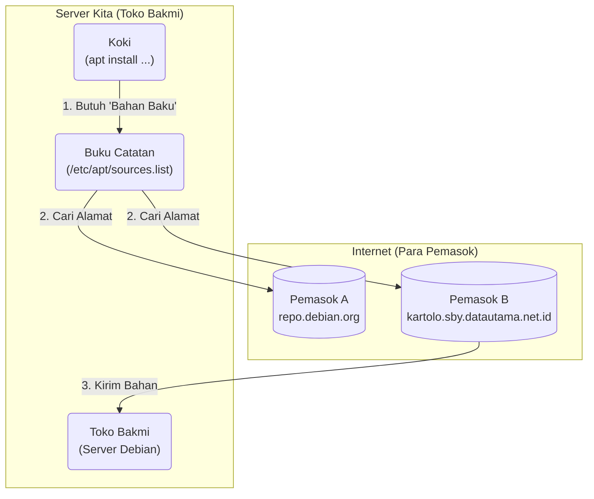

# Konfigurasi Server Debian

Pengenalan Command Line Interface (CLI) untuk Administrator Jaringan

<div class="pt-12">
  <span @click="$slidev.nav.next" class="px-2 py-1 rounded cursor-pointer" hover="bg-white bg-opacity-10">
    Mulai <carbon:arrow-right class="inline"/>
  </span>
</div>

---
transition: fade-out
---

# Apa itu CLI?

<div class="grid grid-cols-2 gap-8 items-center">
  <div>
    <p class="text-xl">
      <strong>Command Line Interface (CLI)</strong> adalah cara kita "berbicara" dengan komputer menggunakan teks. Kita mengetik perintah, dan komputer menjalankannya.
    </p>
    <br>
    <p class="text-xl">
      Ini adalah alat utama bagi seorang Administrator Jaringan untuk mengelola server.
    </p>
  </div>
  <div>
    
  </div>
</div>

<style>
h1, h2, h3 {
  background-image: linear-gradient(45deg, #4EC5D4 10%, #146b8c 20%);
  -webkit-background-clip: text;
  -webkit-text-fill-color: transparent;
}
</style>

---
transition: slide-up
---

# Perumpamaan: CLI vs GUI

Mari kita umpamakan memesan makanan di restoran.

<div class="grid grid-cols-2 gap-8 mt-8">
  <div> 
    <v-click>
      <h3 class="text-2xl font-bold text-cyan-500">GUI (Menu Bergambar)</h3>
      <p class="mt-2">
        Seperti memesan dari buku menu. Kita hanya perlu menunjuk gambar makanan yang kita inginkan. Mudah, tapi pilihan kita terbatas pada apa yang ada di menu.
      </p>
      
    </v-click>
  </div>
  <div>
    <v-click>
      <h3 class="text-2xl font-bold text-lime-500">CLI (Bicara dengan Koki)</h3>
      <p class="mt-2">
        Seperti berbicara langsung dengan koki. Kita bisa bilang: "Saya mau nasi goreng, pedas, tanpa udang, telurnya setengah matang." Lebih kompleks, tapi sangat spesifik dan kuat.
      </p>
      
    </v-click>
  </div>
</div>

---
layout: two-cols
---

# Perintah Dasar Linux (Bagian 1)

Ini adalah beberapa "kata" pertama yang perlu kita pelajari.

<ul>
  <li><v-click><code>pwd</code>: <strong>P</strong>rint <strong>W</strong>orking <strong>D</strong>irectory. <br> Untuk tahu kita sedang berada di folder mana. "Saya ada di mana?"</v-click></li>
  <br>
  <li><v-click><code>mkdir</code>: <strong>M</strong>a<strong>k</strong>e <strong>Dir</strong>ectory. <br> Untuk membuat folder baru. "Buatkan folder baru bernama 'proyek'."</v-click></li>
  <br>
  <li><v-click><code>ls</code>: <strong>L</strong>i<strong>s</strong>t. <br> Untuk melihat isi dari sebuah folder. "Ada apa saja di dalam folder ini?"</v-click></li>
  <br>
  <li><v-click><code>cd</code>: <strong>C</strong>hange <strong>D</strong>irectory. <br> Untuk pindah ke folder lain. "Ayo pindah ke folder 'proyek'."</v-click></li>
</ul>

::right::

<v-click>
<div class="p-4 rounded-lg bg-gray-800">

```bash
# Kita ada di mana?
$ pwd
/home/siswa

# Buat folder baru
$ mkdir tugas_jaringan

# Lihat isinya
$ ls
tugas_jaringan

# Pindah ke folder itu
$ cd tugas_jaringan

# Cek lagi kita di mana
$ pwd
/home/siswa/tugas_jaringan
```
</div>
<p class="text-sm mt-2 text-center">Contoh penggunaan di terminal.</p>
</v-click>

---
layout: two-cols
---

# Perintah Dasar Linux (Bagian 2)

Melanjutkan percakapan kita dengan server.

<ul>
  <li><v-click><code>touch</code>: Membuat sebuah file kosong. <br> "Buatkan file catatan.txt."</v-click></li>
  <br>
  <li><v-click><code>cat</code>: Con<strong>cat</strong>enate. <br> Menampilkan isi dari sebuah file teks. "Tolong bacakan isi file catatan.txt."</v-click></li>
  <br>
  <li><v-click><code>nano</code>: Editor teks sederhana. <br> Untuk menulis atau mengubah isi file. "Buka file catatan.txt untuk saya tulis."</v-click></li>
  <br>
</ul>

::right::

<v-click>
<div class="p-4 rounded-lg bg-gray-800">

```bash
# Buat file baru
$ touch config.txt

# Tulis sesuatu ke dalamnya dengan nano
$ nano config.txt

# Lihat isinya
$ cat config.txt
server_ip=192.168.1.1
```
</div>
<p class="text-sm mt-2 text-center">Contoh penggunaan di terminal.</p>
</v-click>

---
transition: zoom-in
layout: two-cols
---
# Perintah Dasar Linux (Bagian 3)

Menghapus dan memindah/mengubah nama file/folder

<ul>
  <li><v-click><code>rm</code>: <strong>R</strong>e<strong>m</strong>ove. <br> Menghapus file atau folder. "Hapus file yang salah.txt."</v-click></li>
  <br>
  <li><v-click><code>mv</code>: <strong>M</strong>o<strong>v</strong>e. <br> Memindahkan atau mengubah nama file/folder. "Pindahkan file ini" atau "Ganti nama file ini."</v-click></li>
</ul>

::right::

<v-click>
<div class="p-4 rounded-lg bg-gray-800">

```bash

# Ganti namanya
$ mv config.txt server_config.txt

# Hapus file yang tidak perlu
$ rm backup.txt
```
</div>
<p class="text-sm mt-2 text-center">Contoh penggunaan di terminal.</p>
</v-click>

---
transition: zoom-in
---

# Perintah Jaringan Linux

Sekarang, mari kita ajak server "berkenalan" dengan jaringan.

<div class="grid grid-cols-2 gap-6 mt-6">
  <v-click>
    <div class="p-4 bg-teal-900 rounded-lg">
      <h3 class="text-xl font-bold text-teal-300"><code>ip a</code></h3>
      <p>Perintah untuk melihat "KTP" server kita di jaringan, yaitu alamat IP-nya.</p>
    </div>
  </v-click>
  <v-click>
    <div class="p-4 bg-sky-900 rounded-lg">
      <h3 class="text-xl font-bold text-sky-300"><code>ping</code></h3>
      <p>Seperti menyapa server lain. Kita mengirim sinyal kecil untuk memeriksa apakah server tujuan (misal: google.com) aktif dan terhubung.</p>
    </div>
  </v-click>
  <v-click>
    <div class="p-4 bg-indigo-900 rounded-lg">
      <h3 class="text-xl font-bold text-indigo-300"><code>traceroute</code></h3>
      <p>Seperti menggunakan GPS untuk melihat rute mana saja yang dilewati data kita untuk sampai ke tujuan di internet.</p>
    </div>
  </v-click>
    <v-click>
    <div class="p-4 bg-indigo-900 rounded-lg">
      <h3 class="text-xl font-bold text-indigo-300"><code>ip route</code></h3>
      <p>Menampilkan ip gateway atau router yang digunakan oleh server</p>
    </div>
  </v-click>
</div>
<p class="text-center">More in : phoenixnap.com/kb/linux-network-commands</p>

---
transition: slide-left
---

# Repository: "Toko Aplikasi" untuk Linux

<div class="grid grid-cols-2 gap-8 items-center">
  <div>
    <p class="text-xl">
      <strong>Repository</strong> adalah tempat penyimpanan ribuan paket software/aplikasi yang sudah diuji dan siap untuk dipasang di server Debian kita.
    </p>
    <br>
    <p class="text-xl">
      Kita tidak perlu mencari software satu per satu di internet. Cukup beri tahu server apa yang kita mau, dan dia akan mengambilnya dari repository.
    </p>
  </div>
  <div>
    
  </div>
</div>

---
transition: slide-left
layout: two-cols
---

# Analogi: Toko Bakmi Cina

Bayangkan kita adalah pemilik **toko bakmi**.

- **Toko Bakmi (Server Kita):** Tempat kita meracik dan menyajikan "layanan".
- **Bahan Baku (Software):** Mie, sayuran, daging, bumbu yang kita butuhkan.
- **Pemasok/Supplier (Repository):** Tempat terpercaya di mana kita mendapatkan semua bahan baku berkualitas. Kita tidak menanam sayur sendiri, kita ambil dari pemasok.
- **Daftar Alamat Supplier (`sources.list`):** Buku catatan berisi alamat dan kontak semua pemasok terpercaya kita.

::right::

<div class="p-4 rounded-lg bg-gray-800">

</div>
<p class="text-sm mt-2 text-center">Alur kerja Repository sesuai analogi.</p>

---
layout: center
class: text-center
---

# Terima Kasih!

Practice Time!
Ada pertanyaan?

<PoweredBySlidev mt-10 />
