# Administrasi Sistem Jaringan

### Konfigurasi dan Pengujian Remote Server

  
    Mulai <carbon:arrow-right class="inline"/>
  

---
transition: fade-out
---

# Tujuan Pembelajaran 

<ul>
<li>Peserta didik mampu memahami (C2) konsep dasar remote server dan manfaatnya dalam administrasi jaringan.</li>
<li>Peserta didik mampu memahami (C2) cara mengakses server lokal secara remote.</li>
<li>Peserta didik mampu mengkonfigurasi (C3) server lokal untuk diakses secara remote.</li>
<li>Peserta didik mampu mengoperasikan (C3) remote access server menggunakan SSH.</li>
<li>Peserta didik mampu menguraikan (C4) proses koneksi remote server menggunakan SSH.</li>
</ul>

---
transition: fade-out
---

# Apa itu Remote Server Access?

  

    

      <strong>Remote Server Access</strong> adalah kemampuan untuk mengakses dan mengelola sebuah server dari lokasi yang berbeda (jarak jauh) melalui jaringan.
    

     
    

      Ini memungkinkan administrator untuk melakukan konfigurasi, pemeliharaan, dan pengawasan tanpa harus berada di lokasi fisik server.

```mermaid
graph LR
    Admin["🧑‍💻 Administrator"] -->|Jaringan Internet| Server["💾 Server Fisik"];
```
    

  

  

  

---
transition: slide-up
---

# Mengapa Remote Access Penting?

Analogi: Mengelola Toko dari Rumah

  
 
    <v-click>
      <h3 class="text-2xl font-bold text-cyan-500">Tanpa Remote Access (Datang ke Toko)</h3>
      

        Setiap kali perlu mengecek stok, mengatur ulang etalase, atau memperbaiki kasir, Anda harus datang langsung ke toko. Tidak efisien jika Anda punya banyak cabang atau rumah Anda jauh.
      

    </v-click>
  

  

    <v-click>
      <h3 class="text-2xl font-bold text-lime-500">Dengan Remote Access (CCTV & Telepon)</h3>
      

        Anda bisa melihat kondisi toko lewat CCTV (pengawasan), dan memberi instruksi kepada staf lewat telepon (konfigurasi). Jauh lebih efisien, cepat, dan hemat biaya.
      

    </v-click>
  

---
layout: two-cols
---

# Cara Kerja Remote Server

Secara sederhana, prosesnya seperti ini:
<ul class="no-gap">
  <li><v-click><b>Client Mengirim Permintaan</b> Administrator (client) memulai koneksi ke server.</v-click></li>
   
  <li><v-click><b>Verifikasi & Autentikasi</b> Server memeriksa apakah client memiliki izin untuk masuk (username & password, atau kunci digital).</v-click></li>
   
  <li><v-click><b>Koneksi Aman Terbentuk</b> Setelah berhasil, sebuah "terowongan" terenkripsi dibuat untuk melindungi data yang dikirim.</v-click></li>
   
  <li><v-click><b>Eksekusi Perintah</b> Client dapat mengirimkan perintah, dan server akan menjalankannya seolah-olah perintah itu diketik langsung di server.</v-click></li>
</ul>

::right::

<v-click>

Diagram alur koneksi remote.

</v-click>

---
layout: two-cols
---

# Ragam Protokol & Sistem Operasi

Ada berbagai "bahasa" (protokol) dan "tipe server" (Sistem Operasi) yang digunakan.

<ul class="no-gap">
  <li><v-click><b>Sistem Operasi Server</b>
    <ul>
      <li><b>Linux Server (Ubuntu, CentOS, Debian):</b> Paling umum digunakan, bersifat open-source, dan sangat andal. Biasanya diakses menggunakan SSH.</li>
      <li><b>Windows Server:</b> Sistem operasi dari Microsoft. Biasanya diakses menggunakan RDP.</li>
    </ul>
  </v-click>
  </li>
   
  <li><v-click><b>Protokol Remote Access</b>
    <ul>
      <li><b>SSH (Secure Shell):</b> "Bahasa" berbasis teks yang sangat aman karena terenkripsi. Standar untuk server Linux.</li>
      <li><b>RDP (Remote Desktop Protocol):</b> "Bahasa" berbasis grafis (GUI) untuk Windows. Seolah-olah kita melihat langsung layar monitor server.</li>
    </ul>
  </v-click>
  </li>
</ul>

::right::

<v-click>

</v-click>

---
transition: zoom-in
---

# Konfigurasi Dasar Server SSH

Beberapa hal penting yang perlu diatur untuk keamanan:

  <v-click>
    

      <h3 class="text-xl font-bold text-teal-300">Instalasi Layanan</h3>
      
Memasang "pintu" SSH di server agar bisa menerima koneksi.  <code>sudo apt install openssh-server</code>

    

  </v-click>
  <v-click>
    

      <h3 class="text-xl font-bold text-sky-300">Autentikasi Pengguna</h3>
      
Siapa saja yang boleh masuk? Diatur dengan username, password, atau lebih aman lagi dengan SSH Key.

    

  </v-click>
  <v-click>
    

      <h3 class="text-xl font-bold text-indigo-300">Pengaturan Port</h3>
      
Mengganti nomor "pintu" (port) default (22) ke nomor lain agar tidak mudah ditemukan penyusup.

    

  </v-click>
    <v-click>
    

      <h3 class="text-xl font-bold text-rose-300">Firewall</h3>
      
Membuat aturan keamanan, misalnya hanya mengizinkan koneksi dari alamat IP tertentu (misal: IP kantor).

    

  </v-click>

---
layout: center
class: text-center
transition: zoom-in
---

# Studi Kasus

Mari kita analisis beberapa skenario nyata.

---
transition: zoom-in
---
# Studi Kasus 1

Sebuah perusahaan startup memiliki satu server fisik di kantor pusat mereka di Malang yang digunakan untuk data internal. Perusahaan ini baru saja membuka kantor cabang di Jakarta. Seorang administrator jaringan yang berbasis di Jakarta ditugaskan untuk mengelola server tersebut secara penuh, termasuk melakukan pembaruan sistem, manajemen pengguna, dan pemeliharaan rutin. 

<v-click>
<b>Pertanyaan:</b>
Teknologi dan langkah-langkah apa yang harus disiapkan oleh perusahaan agar administrator di Jakarta dapat mengelola server di Malang secara aman dan efisien tanpa harus datang langsung?
</v-click>
---
transition: zoom-in
---
# Studi Kasus 2

Seorang administrator baru di sebuah sekolah menemukan konfigurasi SSH server yang ada saat ini mengizinkan login root secara langsung (`PermitRootLogin yes`) dan masih menggunakan port default 22. Selain itu, tidak ada pembatasan akses berdasarkan alamat IP. 

<v-click>
<b>Pertanyaan:</b>  
Analisislah tiga risiko keamanan utama yang muncul dari konfigurasi tersebut! Untuk setiap risiko, jelaskan potensi dampaknya jika dieksploitasi oleh pihak yang tidak bertanggung jawab.
</v-click>

---
layout: center
class: text-center
---

# Terima Kasih!

Ada pertanyaan?

<PoweredBySlidev mt-10 />
