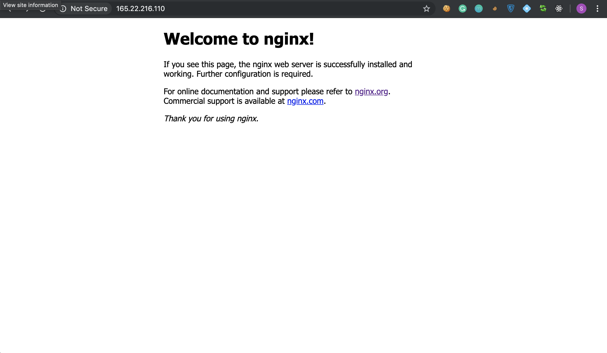
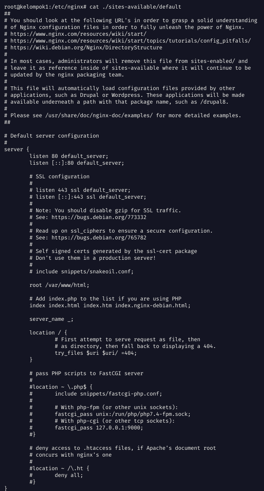
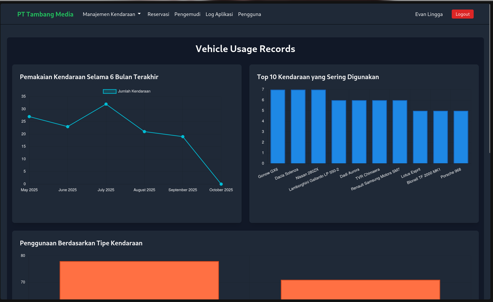

# Prosedur Praktik Web Server Nginx

## Contents:   

- [Melihat Konfigurasi Apache](#a-melihat-konfigurasi-apache)
- [Install Nginx Web Server](#b-install-nginx-web-server)
- [Konfigurasi Web Statis](#c-konfigurasi-web-static)
- [Konfigurasi Web App](#d-konfigurasi-web-app)


## A. Melihat Konfigurasi Apache

Sebelum kita mengganti web server dengan Nginx, mari kita **melihat terlebih dahulu konfigurasi dan status Apache** yang sudah ada di sistem.  
Langkah ini penting agar kita memahami bagaimana Apache mengatur virtual host-nya dan memastikan layanan berjalan sebelum diganti.

### 1. Cek Status Apache

Pastikan layanan Apache masih aktif dan berjalan.

```zsh
systemctl status apache2
```
Jika Apache berjalan dengan baik, kalian akan melihat status seperti berikut:
```zsh
● apache2.service - The Apache HTTP Server
     Loaded: loaded (/lib/systemd/system/apache2.service; enabled; vendor preset: enabled)
     Active: active (running)
```

### 2. Cek VirtualHost yang Aktif

Apache menggunakan konsep VirtualHost untuk mengatur setiap domain atau website yang di-host.
Kalian bisa melihat daftar konfigurasi virtual host yang aktif dengan perintah:
```zsh
apache2ctl -S
```

Contoh keluaran:
```zsh
VirtualHost configuration:
*:80                   is a NameVirtualHost
     default server     (/etc/apache2/sites-enabled/000-default.conf:1)
     port 80 namevhost  (/etc/apache2/sites-enabled/example.conf:1)
ServerRoot: "/etc/apache2"
Main DocumentRoot: "/var/www/html"
```

###  3. Lihat Isi Konfigurasi Default VirtualHost
Selanjutnya, lihat isi konfigurasi default Apache yang biasanya terletak di:
```zsh
cat /etc/apache2/sites-available/000-default.conf
```

Contoh isi file:
```zsh
<VirtualHost *:80>
    ServerAdmin webmaster@localhost
    DocumentRoot /var/www/html

    ErrorLog ${APACHE_LOG_DIR}/error.log
    CustomLog ${APACHE_LOG_DIR}/access.log combined
</VirtualHost>
```

Dari sini kita tahu:    
- Apache melayani port 80 (<VirtualHost *:80>)
- Folder web utama ada di /var/www/html
- Log error dan akses disimpan di /var/log/apache2/

### 4. Kunjungi Halaman Default Apache

Buka browser dan akses `http://<Alamat IP>`. Kalian akan melihat tampilan default apache2

## B. Install Nginx Web Server

Setelah memastikan Apache berjalan dan memahami konfigurasi VirtualHost-nya, kita akan menonaktifkan Apache dan menggantikannya dengan Nginx.

### 1. Nonaktifkan Apache2
Matikan dan nonaktifkan layanan Apache2 secara permanen dengan perintah berikut.
```zsh
systemctl mask apache2
```
Setelah perintah ini dijalankan, Apache tidak akan bisa dijalankan lagi (baik manual maupun saat boot) sampai di-unmask. Ini memastikan tidak ada konflik port dengan Nginx.
Setelah kalian mematikan layanan Apache2, maka ketika kalian mengunjungi di web browser tidak akan ada tampilan default Apache2.

### 2. Install Nginx
Install paket Nginx menggunakan `apt`.
```zsh
apt install nginx
```

### 3. Cek Status Nginx
Setelah instalasi selesai, pastikan layanan Nginx aktif dan berjalan.
```zsh
systemctl status nginx
```
Keluaran yang diharapkan:
```zsh
● nginx.service - A high performance web server and a reverse proxy server
     Loaded: loaded (/lib/systemd/system/nginx.service; enabled; vendor preset: enabled)
     Active: active (running)
```

### 4. Kunjungi Halaman Default Nginx
Buka browser dan akses `http://<Alamat IP>`. Kalian akan melihat halaman selamat datang default dari Nginx.


Selamat! Kalian telah berhasil melakukan instalasi dan menjalankan Nginx web server.

## C. Konfigurasi Web Static

Pada kasus ini, kita akan menghosting sebuah web static dengan membuat file konfigurasi *virtual host* baru di Nginx.

### 1. Pahami Konfigurasi Default Nginx
Pertama, mari kita lihat struktur konfigurasi default yang disediakan Nginx.
Pindah ke direktori konfigurasi Nginx:
```zsh
cd /etc/nginx
```
Lihat isi file konfigurasi default:
```zsh
cat ./sites-available/default
```
Tampilan dari konfigurasi default akan terlihat seperti berikut:


Penjelasan singkat mengenai beberapa arahan (directives) penting dalam file tersebut:
| **Blok / Direktif** | **Fungsi / Kegunaan** | **Contoh Penggunaan** | **Keterangan Tambahan** |
|----------------------|------------------------|------------------------|--------------------------|
| `server` | Menandakan satu *virtual host* atau konfigurasi server dalam Nginx. Di dalam blok ini berisi aturan untuk satu domain atau aplikasi tertentu. | `server { listen 80; server_name example.com; root /var/www/example; }` | Dapat terdapat beberapa `server` dalam satu file konfigurasi Nginx untuk menangani banyak domain. |
| `listen` | Menentukan port dan alamat IP yang digunakan untuk menerima koneksi. | `listen 80;` | Biasanya `80` untuk HTTP dan `443 ssl` untuk HTTPS. Bisa juga ditulis `listen 127.0.0.1:8080;`. |
| `root` | Menentukan direktori utama tempat file web disajikan. | `root /var/www/example;` | Semua file yang diminta oleh klien akan dicari di folder ini, kecuali jika diubah dalam blok `location`. |
| `index` | Menentukan file utama yang akan dibuka ketika pengguna mengakses folder tanpa nama file. | `index index.html index.htm;` | Urutan file penting — Nginx akan mencoba dari kiri ke kanan. |
| `server_name` | Menentukan nama domain atau subdomain yang dilayani oleh blok `server` tersebut. | `server_name example.com www.example.com;` | Bisa juga pakai wildcard (`*.example.com`) atau `_` untuk default. |
| `location` | Mengatur cara Nginx menangani permintaan (request) pada path atau pola tertentu. | `location /images/ { root /data; }` | Bisa digunakan untuk routing, proxy, rewrite URL, atau pembatasan akses. Gunakan awalan `/`, `~`, atau `^~` untuk kontrol pola. |

### 2. Hapus Konfigurasi Default
Agar tidak terjadi konflik dan untuk memulai dengan konfigurasi yang bersih, kita akan menghapus file konfigurasi default.
```zsh
rm /etc/nginx/sites-available/default
rm /etc/nginx/sites-enabled/default
```

### 3. Buat Konfigurasi Baru untuk Web Statis
Selanjutnya, kita akan membuat file konfigurasi baru bernama `webstatic`.
Buat file baru di dalam `sites-available`:
```zsh
touch /etc/nginx/sites-available/webstatic
```
Kemudian, edit file tersebut menggunakan `nano`:
```zsh
nano /etc/nginx/sites-available/webstatic
```
Isi file konfigurasi dengan konten berikut. Konfigurasi ini memberitahu Nginx untuk menyajikan file dari direktori `/var/www/brun`.
```nginx
server {
    listen 80;
    server_name _;

    root /var/www/brun;

    location / {
        try_files $uri $uri/ =404;        
    }
}
```

### 4. Verifikasi dan Aktifkan Konfigurasi
Sebelum menerapkan perubahan, selalu uji file konfigurasi untuk memastikan tidak ada kesalahan sintaks.
```zsh
nginx -t
```
Jika konfigurasi valid, kalian akan melihat pesan sukses:
```zsh
nginx: the configuration file /etc/nginx/nginx.conf syntax is ok
nginx: configuration file /etc/nginx/nginx.conf test is successful
```
Setelah verifikasi berhasil, aktifkan konfigurasi dengan membuat *symbolic link* (symlink) dari `sites-available` ke `sites-enabled`.
```zsh
ln -s /etc/nginx/sites-available/webstatic /etc/nginx/sites-enabled
```
Terakhir, muat ulang (reload) layanan Nginx agar perubahan diterapkan.
```zsh
systemctl reload nginx
```

### 5. Kunjungi Halaman Web Statis
Setelah Nginx di-reload, buka kembali browser dan akses `http://<Alamat IP>`. Kalian seharusnya melihat halaman web statis yang sudah disiapkan.


Selamat! Kalian telah berhasil melakukan hosting sebuah web statis dengan Nginx.

## D. Konfigurasi Web App

Pada kasus kedua, kita akan menghosting sebuah web app atau web yang bisa modifikasi data di database dengan membuat file konfigurasi *virtual host* baru di Nginx.

### 1. Buat Konfigurasi Baru untuk Web App
Kita akan membuat file konfigurasi baru bernama `webapp`.
```zsh
touch /etc/nginx/sites-available/webapp
```
Kemudian, edit file tersebut:
```zsh
nano /etc/nginx/sites-available/webapp
```
Isi file dengan konfigurasi berikut. Konfigurasi ini dirancang untuk aplikasi berbasis PHP (seperti Laravel) yang menggunakan pola *front-controller*.
```nginx
server {
    listen 80;
    server_name _;

    root /var/www/html/public;

    index index.php index.html;
    
    location / {
        try_files $uri $uri/ /index.php?$query_string;
    }

    location ~ \.php$ {
        include snippets/fastcgi-php.conf;
        fastcgi_pass unix:/run/php/php8.2-fpm.sock;
    }

    location ~ /\.ht {
        deny all;
    }
}
```

### 2. Pahami Konfigurasi Web App
Konfigurasi ini memiliki beberapa perbedaan penting dibandingkan dengan web statis:

| **Blok / Direktif** | **Fungsi / Kegunaan** | **Keterangan Tambahan** |
|----------------------|------------------------|--------------------------|
| `root` | Menunjuk ke direktori `/var/www/html/public`. | Aplikasi Laravel hanya mengekspos folder `public` untuk keamanan, di mana `index.php` sebagai pintu masuk utama berada. |
| `location /` | Mengarahkan semua permintaan yang tidak ditemukan ke `index.php`. | `try_files` mencoba mencari file/folder yang cocok; jika gagal, permintaan dialihkan ke `index.php` untuk diproses oleh aplikasi. |
| `location ~ \.php$` | Memproses semua file yang berakhiran `.php`. | Blok ini meneruskan permintaan file PHP ke *PHP-FPM (FastCGI Process Manager)* melalui `fastcgi_pass` agar kode PHP dapat dieksekusi di server. |

### 3. Aktifkan Konfigurasi dan Hapus Konfigurasi Lama
Sebelumnya kita sudah membuat konfigurasi untuk web statis, kita perlu menghapusnya terlebih dahulu.
```zsh
rm /etc/nginx/sites-enabled/webstatic
```
Setelah itu, aktifkan konfigurasi `webapp` dengan membuat *symlink*.
```zsh
ln -s /etc/nginx/sites-available/webapp /etc/nginx/sites-enabled
```
Uji kembali konfigurasi dan muat ulang Nginx.
```zsh
nginx -t
systemctl reload nginx
```

### 4. Kunjungi Halaman Web App
Buka browser dan akses `http://<Alamat IP>`. Kalian akan melihat halaman web app yang telah di-deploy. Aplikasi ini adalah aplikasi web dinamis yang berjalan di atas PHP dan Nginx.



NOTE: gunakan akun berikut untuk mengakses dashboard

<table border="1">
  <thead>
    <tr>
      <th>Fullname</th>
      <th>Email</th>
      <th>Password</th>
      <th>Role</th>
    </tr>
  </thead>
  <tbody>
    <tr>
      <td>Evan Lingga</td>
      <td>evanlingga@gmail.com</td>
      <td>password</td>
      <td>Admin</td>
    </tr>
    <tr>
      <td>Tade Gina</td>
      <td>tadegina@gmail.com</td>
      <td>password</td>
      <td>Approver</td>
    </tr>
  </tbody>
</table>

Selamat! Kalian telah berhasil mengkonfigurasi Nginx untuk melayani aplikasi web dinamis.


